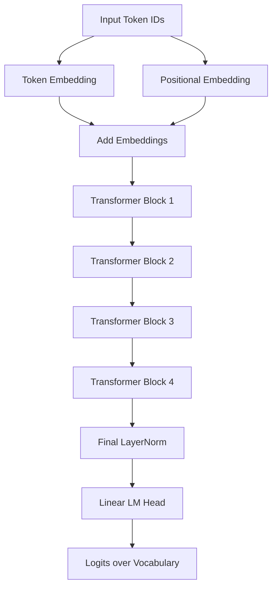
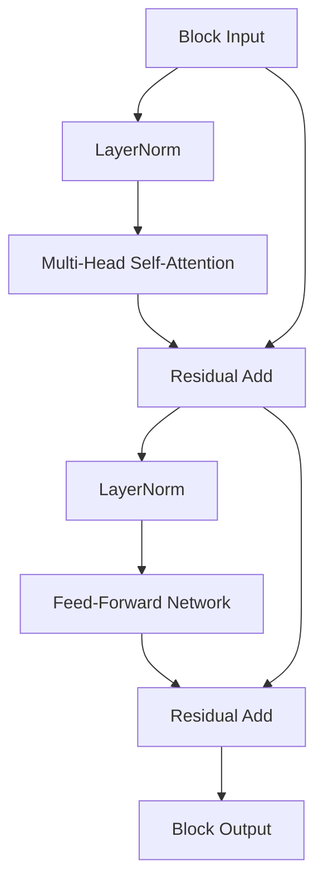

# MiniGPT — GPT-Style Language Model Built From Scratch with PyTorch

A small, from-scratch, character-level, decoder-only Transformer language model — built to understand *how* GPT-style models actually work under the hood, not to compete with production LLMs.

---

## Table of Contents

1. [Project Description](#project-description)
2. [Author](#author)
3. [Why I Built This Project](#why-i-built-this-project)
4. [What This Project Demonstrates](#what-this-project-demonstrates)
5. [Architecture Overview](#architecture-overview)
6. [Project Structure](#project-structure)
7. [Tokenization](#tokenization)
8. [Dataset Preparation](#dataset-preparation)
9. [Embeddings](#embeddings)
10. [Transformer Architecture](#transformer-architecture)
11. [Multi-Head Attention](#multi-head-attention)
12. [Causal Masking](#causal-masking)
13. [Feed-Forward Network](#feed-forward-network)
14. [Residual Connections and LayerNorm](#residual-connections-and-layernorm)
15. [Training Process](#training-process)
16. [Text Generation](#text-generation)
17. [Model Configuration](#model-configuration)
18. [Example Training Output](#example-training-output)
19. [Example Generated Text](#example-generated-text)
20. [How to Run the Project](#how-to-run-the-project)
21. [Requirements](#requirements)
22. [Future Improvements](#future-improvements)
23. [Learning Outcomes](#learning-outcomes)
24. [Limitations](#limitations)
25. [Author Section](#author-section)

---

## Project Description

**MiniGPT** is an educational, decoder-only, GPT-style language model implemented entirely from scratch using **PyTorch**. It reproduces — at a small, understandable scale — the core building blocks that power modern large language models: token and positional embeddings, multi-head causal self-attention, feed-forward networks, residual connections, layer normalization, and autoregressive text generation.

> ⚠️ **This is a small educational implementation, NOT a production-scale GPT model.** It does not have human-level language understanding. Its purpose is purely to demonstrate, in code, how GPT-style architectures work internally.

---

## Author

**Shashank S**
Background: Artificial Intelligence & Machine Learning

---

## Why I Built This Project

Modern language models like GPT are often treated as "black boxes" — powerful, but opaque. I built MiniGPT to open that box myself: to implement every core mechanism of a GPT-style Transformer by hand, from tokenization to autoregressive generation, instead of only using pre-built libraries.

The goal was **understanding through implementation** — writing the attention math, the masking logic, and the training loop myself so that each concept becomes tangible rather than theoretical.

---

## What This Project Demonstrates

This project demonstrates practical, hands-on understanding of:

- How raw text is converted into model-readable tokens
- How token and positional information are embedded into vectors
- How self-attention allows tokens to "look at" other tokens
- How causal masking enforces autoregressive (left-to-right) prediction
- How multiple attention heads capture different relationships in parallel
- How residual connections and layer normalization stabilize deep networks
- How a full training loop (forward pass, loss, backpropagation, optimizer step) works
- How a trained model generates new text one token at a time

---

## Architecture Overview

MiniGPT follows the standard **decoder-only Transformer** design popularized by GPT:



Each **Transformer Block** internally looks like this:



---

## Project Structure

```
MiniGPT/
├── data/
│   └── train.txt              # Raw training text (character-level corpus)
├── src/
│   ├── dataset.py              # Batch creation and next-token targets
│   ├── tokenizer.py            # Character-level encode/decode logic
│   ├── prepare_data.py         # Data loading and preprocessing
│   ├── embedding_test.py       # Script to test embedding layers
│   ├── model.py                # Full GPT model definition
│   ├── generate.py             # Autoregressive text generation
│   └── transformer_block.py    # Single Transformer block implementation
├── minigpt.pth                 # Saved trained model weights
├── README.md                   # Project documentation (this file)
└── .gitignore
```

| File | Responsibility |
|---|---|
| `tokenizer.py` | Character ↔ integer mapping (`stoi`, `itos`, `encode`, `decode`) |
| `dataset.py` | Converts text to token IDs and builds `(x, y)` training batches |
| `prepare_data.py` | Loads and prepares `train.txt` for training |
| `model.py` | Defines the full MiniGPT model (embeddings + blocks + LM head) |
| `transformer_block.py` | Implements one Transformer block (attention + feed-forward) |
| `generate.py` | Loads `minigpt.pth` and generates text autoregressively |
| `embedding_test.py` | Sanity-checks embedding layer shapes and outputs |

---

## Tokenization

MiniGPT uses **character-level tokenization** — the simplest and most transparent tokenization scheme, ideal for learning purposes.

The tokenizer:

- Reads the full contents of `train.txt`
- Finds all unique characters in the text
- Sorts them into a fixed vocabulary
- Builds a `stoi` (string-to-index) mapping
- Builds an `itos` (index-to-string) mapping
- Provides an `encode()` function → text → list of token IDs
- Provides a `decode()` function → list of token IDs → text

```python
# Conceptual example
chars = sorted(list(set(text)))
stoi = {ch: i for i, ch in enumerate(chars)}
itos = {i: ch for i, ch in enumerate(chars)}

encode = lambda s: [stoi[c] for c in s]
decode = lambda l: ''.join([itos[i] for i in l])
```

With `vocab_size = 65`, the model works over a 65-character vocabulary (letters, punctuation, whitespace, etc., depending on the corpus).

---

## Dataset Preparation

The dataset module converts the raw text corpus into training-ready batches:

- Encodes the entire text into a single long sequence of token IDs
- Randomly samples starting positions within that sequence
- Extracts fixed-length chunks of size `block_size = 64`
- Builds `x` — the input sequence
- Builds `y` — the same sequence shifted **one token forward** (the next-token targets)
- Returns batches of shape `(batch_size, block_size)` for training

This is the standard **next-token prediction** setup used to train autoregressive language models.

```python
# Conceptual batch structure
x = data[i : i + block_size]
y = data[i + 1 : i + block_size + 1]
```

---

## Embeddings

Two embedding layers give the model information about **what** each token is and **where** it is in the sequence:

- **Token Embedding**: maps each token ID to a learned `embedding_dim = 128` vector representing its meaning
- **Positional Embedding**: maps each position (0 to `block_size - 1`) to a learned vector representing its location in the sequence

The two embeddings are **added together** element-wise before being passed into the Transformer blocks, giving the model both content and order information.

---

## Transformer Architecture

The full forward pass of MiniGPT flows as follows:

```
Input Token IDs
    → Token Embedding
    → Positional Embedding
    → Add Embeddings
    → 4 × Transformer Blocks
    → Final LayerNorm
    → Linear Language Model Head
    → Logits
```

The model stacks **4 Transformer blocks** (`number of transformer blocks = 4`), each refining the token representations by mixing information across the sequence (via attention) and across feature dimensions (via the feed-forward network).

---

## Multi-Head Attention

Self-attention is the mechanism that lets each token gather information from other tokens in the sequence. MiniGPT implements it manually:

1. Projects the input into **Query (Q)**, **Key (K)**, and **Value (V)** matrices
2. Splits the embedding dimension into `num_heads = 4` heads, each of `head_dim = 32`
3. Computes attention scores: `QKᵀ`
4. Scales the scores by `1 / sqrt(head_dim)` for numerical stability
5. Applies a **causal lower-triangular mask** (see below)
6. Applies **softmax** to turn scores into attention weights
7. Multiplies the attention weights by `V` to get weighted context vectors
8. **Concatenates** the outputs of all heads back together
9. Applies a final **output projection** layer

Running multiple heads in parallel allows the model to attend to different types of relationships (e.g., nearby characters vs. longer-range patterns) simultaneously.

---

## Causal Masking

Because MiniGPT is **autoregressive** (it predicts the next token using only past tokens), it must never be allowed to "see the future" during training.

This is enforced with a **lower-triangular mask** applied to the attention scores before softmax:

- Positions **before or at** the current token → visible
- Positions **after** the current token → masked out (set to `-infinity`)

After softmax, masked positions collapse to an attention weight of zero, so each token can only attend to itself and earlier tokens.

```python
# Conceptual mask
mask = torch.tril(torch.ones(block_size, block_size))
scores = scores.masked_fill(mask == 0, float('-inf'))
```

---

## Feed-Forward Network

After attention, each token representation passes through a position-wise feed-forward network:

- Linear layer: `embedding_dim (128) → feed_forward_dim (512)`
- **GELU** activation function
- Linear layer: `feed_forward_dim (512) → embedding_dim (128)`

This network is applied identically and independently to every token position, adding non-linear transformation capacity on top of what attention produces.

---

## Residual Connections and LayerNorm

To keep a 4-block-deep network trainable and stable, MiniGPT uses:

- **Residual (skip) connections**: the input to a sub-layer (attention or feed-forward) is added back to its output, helping gradients flow through the network
- **Layer Normalization**: normalizes activations across the embedding dimension before each sub-layer, improving training stability

Each Transformer block applies this pattern twice — once around attention, once around the feed-forward network:

```
x = x + Attention(LayerNorm(x))
x = x + FeedForward(LayerNorm(x))
```

---

## Training Process

The training loop follows the standard supervised learning cycle for next-token prediction:

1. Sample a random batch of `(x, y)` pairs from the dataset
2. Run `x` through the model to obtain logits
3. Flatten logits and targets to compute the loss
4. Compute **Cross-Entropy Loss** between predicted logits and actual next tokens (`y`)
5. Clear (`zero_grad`) previous gradients
6. Run **backpropagation** (`loss.backward()`)
7. Update parameters using the **AdamW** optimizer
8. Repeat for `training steps = 5000`
9. Save the trained weights to `minigpt.pth`

```python
# Conceptual training step
logits = model(x)
loss = F.cross_entropy(logits.view(-1, vocab_size), y.view(-1))
optimizer.zero_grad()
loss.backward()
optimizer.step()
```

---

## Text Generation

Once trained, MiniGPT generates text **autoregressively** — one character at a time:

1. Load the trained model weights from `minigpt.pth`
2. Accept a starting prompt (or a single starting token)
3. Run a forward pass to predict the next-token logits
4. Select the next token (e.g., via sampling from the softmax distribution)
5. Append the new token to the context sequence
6. Repeat the process, feeding the extended sequence back into the model
7. Decode the final list of token IDs back into readable text using `decode()`

```python
# Conceptual generation loop
for _ in range(max_new_tokens):
    logits = model(context)
    probs = F.softmax(logits[:, -1, :], dim=-1)
    next_token = torch.multinomial(probs, num_samples=1)
    context = torch.cat([context, next_token], dim=1)

output_text = decode(context[0].tolist())
```

---

## Model Configuration

| Parameter | Value |
|---|---|
| `vocab_size` | 65 |
| `embedding_dim` | 128 |
| `block_size` | 64 |
| `num_heads` | 4 |
| `head_dim` | 32 |
| `feed_forward_dim` | 512 |
| Number of Transformer blocks | 4 |
| `batch_size` | 4 |
| Training steps | 5000 |
| Learning rate | 0.001 |
| Optimizer | AdamW |
| Loss function | Cross-Entropy |

---

## Example Training Output

> The values below are illustrative — actual numbers will vary depending on your dataset and hardware.

```
step 0:    train loss 4.3021
step 500:  train loss 2.7148
step 1000: train loss 2.3092
step 1500: train loss 2.0587
step 2000: train loss 1.8734
step 2500: train loss 1.7261
step 3000: train loss 1.6098
step 3500: train loss 1.5203
step 4000: train loss 1.4511
step 4500: train loss 1.3980
step 5000: train loss 1.3542
Model saved to minigpt.pth
```

---

## Example Generated Text

> Illustrative sample only — actual output depends entirely on the training corpus used.

```
Prompt: "The "

Generated:
The king stood at the gate and the men of the town
began to speak of what the morning had brought...
```

At this small scale, output will often be locally coherent (plausible spelling, word-like structures) but may lack long-range logical consistency — this is expected and discussed further in [Limitations](#limitations).

---

## How to Run the Project

1. **Clone the repository**
   ```bash
   git clone https://github.com/<your-username>/MiniGPT.git
   cd MiniGPT
   ```

2. **Install dependencies**
   ```bash
   pip install torch
   ```

3. **Prepare the dataset**
   ```bash
   python src/prepare_data.py
   ```

4. **Train the model**
   ```bash
   python src/model.py
   ```

5. **Generate text with the trained model**
   ```bash
   python src/generate.py
   ```

---

## Requirements

- Python 3.8+
- PyTorch
- A `train.txt` corpus placed inside `data/`

```
torch>=2.0.0
```

---

## Future Improvements

- [ ] Move from character-level to subword (BPE) tokenization
- [ ] Increase model depth, embedding dimension, and context length
- [ ] Add dropout and additional regularization
- [ ] Add learning rate scheduling / warmup
- [ ] Add validation loss tracking and early stopping
- [ ] Support top-k / top-p (nucleus) sampling for generation
- [ ] Add checkpointing at multiple training steps
- [ ] Experiment with larger, more diverse training corpora
- [ ] Add unit tests for each module

---

## Learning Outcomes

Building MiniGPT reinforced practical understanding of:

- The internal mechanics of self-attention and why scaling and masking matter
- How embeddings encode both meaning and position
- Why residual connections and normalization are essential for deep networks
- How the training loop connects loss, gradients, and optimization in practice
- How autoregressive generation differs fundamentally from single-shot prediction
- Why scale (data, parameters, compute) — not just architecture — is what separates a toy model like this from real-world GPT systems

---

## Limitations

- **Small scale**: far fewer parameters and training data than real-world GPT models
- **Character-level tokenization**: less efficient and less semantically rich than subword tokenization used in production models
- **No human-level understanding**: MiniGPT does not "understand" language; it learns statistical patterns in the training text
- **Short context window**: `block_size = 64` limits how much prior text the model can consider
- **Limited training**: 5000 steps on a small corpus is sufficient for learning purposes but not for high-quality generation
- **No evaluation benchmarks**: no formal perplexity/benchmark evaluation is included in this version

This project is intended purely as a **learning tool** to understand how GPT-style architectures work internally — not as a general-purpose or production-ready language model.

---

## Author Section

**Shashank S**
Artificial Intelligence & Machine Learning

Built as a hands-on educational project to understand GPT-style Transformer architectures from first principles — from raw text to trained weights to generated text.

If you found this project useful for learning, feel free to ⭐ star the repository.